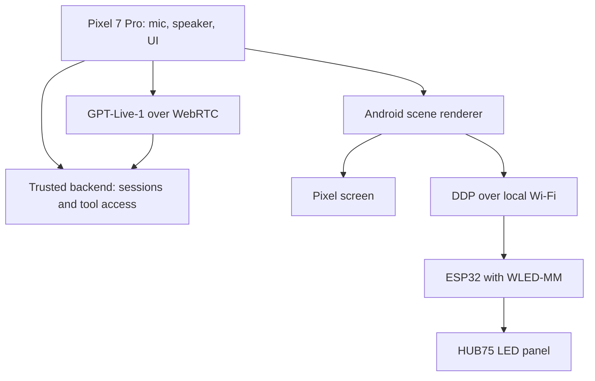

# Pixel to Pi: voice assistant + LED display

Use a spare Pixel 7 Pro as the always-available voice and rendering device in the [OpenAI LED-display project](https://developers.openai.com/blog/bringing-my-led-display-to-life). Start by using the phone's own screen, then add a physical LED panel if the assistant proves useful.

**Status:** feasibility and implementation brief; no application code or hardware integration has been tested in this repository.

## Finding

**Yes, the Pixel can replace the Raspberry Pi's role.** In the article, the Raspberry Pi runs the voice service and renderer. A separate ESP32-based controller running WLED-MM drives the 128 × 64 HUB75 panel. The Pi sends rendered RGB frames to that controller over the local network using DDP. Replacing the Pi therefore does **not** mean connecting a bare HUB75 panel directly to the phone. [Source: OpenAI build article](https://developers.openai.com/blog/bringing-my-led-display-to-life).

| Job in the article | Raspberry Pi build | Proposed Pixel build |
| --- | --- | --- |
| Hear and answer | External microphone and speaker, Pi voice service | Pixel microphone and speaker, Android voice app |
| Voice model | GPT-Live-1 session | Same API over WebRTC |
| Research and actions | Client delegation to a Responses API model and approved tools | Delegation handled by a small trusted backend; Android app handles local display actions |
| Draw scenes | Pi renderer emits 128 × 64 RGB frames | Android renderer draws into a 128 × 64 bitmap |
| Show pixels on HUB75 panel | Pi sends DDP to ESP32/WLED-MM | Pixel sends DDP over Wi-Fi to the same kind of controller |
| Stay available | Linux services on the Pi | Android foreground-service and lifecycle work; more operational risk |

The last row is the main difference. This is an **Android application project**, not a drop-in move of the Pi's Linux services.

## Recommended architecture

- **Pixel app:** native Android app, preferably Kotlin; microphone permission, visible tap-to-talk UI, audio/WebRTC, scene rendering, optional local-network DDP sender.
- **Trusted backend:** holds the OpenAI API key, creates Live sessions, and grants only the calendar/web/ErzyCall actions needed. OpenAI's [WebRTC guide](https://developers.openai.com/api/docs/guides/voice-webrtc) keeps the project key and session configuration on the trusted server. Never hard-code the project key in the Android app or a public web page.
- **Voice and tools:** GPT-Live-1 handles speech and interruptions. For tasks needing data or an action, use [Responses delegation or client delegation](https://developers.openai.com/api/docs/guides/live-delegation). The blog used client delegation to a second model; that particular split is an example, not a requirement for an MVP.
- **Display:** keep a small validated scene format (for example: agenda, message, weather, countdown). Render locally to the phone screen first. Later generate 128 × 64 RGB frames and send DDP to the panel controller. [WLED documents DDP reception on port 4048](https://kno.wled.ge/interfaces/ddp/). Validate panel pixel mapping, color order, Wi-Fi stability, and frame rate on the actual hardware.

## Build order

1. **Useful phone-only MVP.** Build tap-to-talk, a voice reply, and one on-screen scene such as today's agenda or a follow-up reminder. Test whether it saves time in normal use.
2. **Connect one real data source.** Start with a read-only calendar or a narrowly scoped ErzyCall status endpoint. Keep write actions out until access controls and confirmation behavior are clear.
3. **Add the LED panel if the MVP earns it.** Obtain a compatible HUB75 panel, suitable power supply, and an ESP32 controller that supports the chosen WLED-MM HUB75 configuration. Put Pixel and controller on the same reachable Wi-Fi network. Send a static test pattern before building animations. [WLED-MM HUB75 documentation](https://mm.kno.wled.ge/2D/HUB75/).
4. **Add room-assistant behavior.** Improve reconnects, audio routing, wake/sleep behavior, and only then evaluate a local wake word such as “Hey Jack.” Test the locked-screen and overnight behavior on the actual Pixel.

**Acceptance checks for the first milestone:** the phone can hear a tap-to-talk request, speak a response, update its display, recover from a temporary Wi-Fi interruption, and work without a laptop being on. These are proposed checks, not results already achieved.

## Android constraints

- An always-listening microphone requires Android permissions and an appropriately declared `microphone` foreground service. Android permits continuing microphone capture after the app leaves the screen, but restricts starting that service while the app is already in the background and, subject to exceptions, from `BOOT_COMPLETED`. A fully automatic restart after reboot is therefore a design problem to test; do not assume the Pi's boot-time behavior transfers to the Pixel. [Android foreground service types](https://developer.android.com/develop/background-work/services/fgs/service-types).
- On Android 17, background audio playback and related audio operations also require a visible activity or an appropriate foreground service. Start the service while the app is visible. [Android 17 background audio guidance](https://developer.android.com/about/versions/17/changes/bg-audio).
- Battery management can affect background network work. Test long sessions, charging, heat, screen-off behavior, and recovery from Android process termination on the actual device. [Android Doze and App Standby guidance](https://developer.android.com/training/monitoring-device-state/doze-standby).
- Tap-to-talk is the simplest first milestone. A local wake-word detector avoids continuously sending room audio to the model, but it adds app, battery, and reliability work. Its behavior has **not** been validated here.
- A browser prototype may demonstrate voice and phone-screen rendering quickly, but a native app is the sensible path to a robust locked-screen room assistant. The OpenAI [WebRTC browser example](https://developers.openai.com/api/docs/guides/voice-webrtc) is a starting point for the connection flow, not proof that mobile-browser background audio will work continuously.

## What would make this worth building?

The phone is already owned, so the initial experiment can avoid LED hardware. Favor jobs that are visible and useful at a glance: next meeting, missed ErzyCall conversations requiring follow-up, a live daily task/countdown, or a calendar reminder. Measure actual time saved and frequency of use for a week before investing in the panel and all-day wake word.

## Open decisions

- Is the desired output the **Pixel screen**, a **separate LED panel**, or both?
- Which *one* data source should power the first scene (calendar, ErzyCall, or something else)?
- Where should the trusted session/tool backend run?
- Should the assistant require a tap, or is hands-free activation essential from day one?
- Which exact panel/controller/power supply, if an LED panel is added? The article does not establish compatibility with every ESP32 board or HUB75 panel.

## Sources

- [OpenAI: Bringing my LED display to life with GPT-Live-1 and Codex](https://developers.openai.com/blog/bringing-my-led-display-to-life)
- [OpenAI: WebRTC for GPT-Live](https://developers.openai.com/api/docs/guides/voice-webrtc)
- [OpenAI: GPT-Live delegation and tools](https://developers.openai.com/api/docs/guides/live-delegation)
- [Android: foreground service types](https://developer.android.com/develop/background-work/services/fgs/service-types)
- [Android: background audio hardening](https://developer.android.com/about/versions/17/changes/bg-audio)
- [Android: Doze and App Standby](https://developer.android.com/training/monitoring-device-state/doze-standby)
- [WLED: DDP protocol](https://kno.wled.ge/interfaces/ddp/)
- [WLED-MM: HUB75 support](https://mm.kno.wled.ge/2D/HUB75/)
